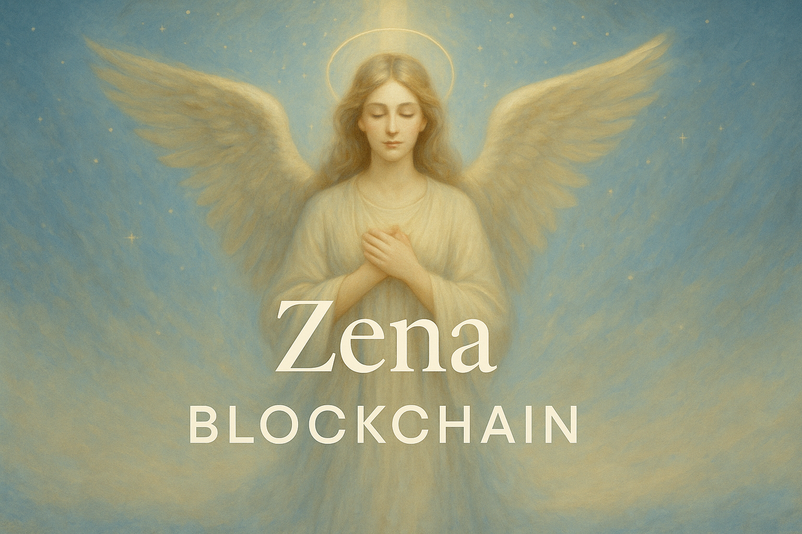

# Zenanet: A Peaceful EVM-Enabled Cosmos SDK Chain

**Zena** (meaning “peace”) is a Cosmos SDK blockchain that delivers seamless Ethereum Virtual Machine (EVM) compatibility through a modular plug-in. Designed to foster harmonious interoperability, Zena empowers developers to deploy and interact with smart contracts while retaining native Cosmos features.

---

## 🚀 Project Overview

- **Modular EVM Integration**: A plug-and-play EVM module (`x/evm`) that adds JSON-RPC, EIP-1559 fee market, and Ethereum-compatible APIs on top of Cosmos SDK.
- **Peaceful Interchain Harmony**: Built-in IBC support enables secure token transfers and cross-chain messaging with other Cosmos blockchains.
- **Extensible Architecture**: Customize precompiles, add custom opcodes, or build permissioned EVM modules for bespoke governance and compliance.

---

## ✨ Key Features

1. **Out-of-the-Box Functionality**

   - Ready-to-use JSON-RPC endpoints (`eth_*`), transaction pool, and account management.
   - Compatible with popular Ethereum development tools like MetaMask, Hardhat, and Truffle.

2. **EIP-1559 Fee Market**

   - Dynamic base fee adjustments provide predictable transaction fees and improved network stability.

3. **IBC & ERC-20 Integration**

   - Seamlessly bridge tokens between Zena, other Cosmos chains, and Ethereum networks.

4. **Custom Precompiles & Opcodes**

   - Extend or override default EVM behavior to meet specific application requirements.

5. **Peaceful Governance**

   - Includes governance and staking modules for transparent, community-driven upgrades.

---

## 🏁 Quickstart

1. **Clone the repository**

   ```bash
   git clone https://github.com/zanentwork/zena.git
   cd zena
   ```

2. **Configure**

   - Edit `config/genesis.json` to define your validator set and initial parameters.
   - Set `chain-id = "zena_1-1"` in `config/config.toml`.

3. **Build & Run**

   ```bash
   make install
   zenad start
   ```

4. **Interact**
   Use the `zenad` CLI or any Ethereum-compatible wallet:

   ```bash
   zenad tx evm send --to <address> --amount 1azena
   ```

---


## Getting started

To run the example `zenad` chain, run the script using `./local_node.sh`
from the root folder of the respository.

### Testing

All of the test scripts are found in `Makefile` in the root of the repository.
Listed below are the commands for various tests:

#### Unit Testing

```bash
make test-unit
```

#### Coverage Test

This generates a code coverage file `filtered_coverage.txt` and prints out the
covered code percentage for the working files.

```bash
make test-unit-cover
```

#### Fuzz Testing

```bash
make test-fuzz
```

#### Solidity Tests

```bash
make test-solidity
```

#### Benchmark Tests

```bash
make benchmark
```

---


## 📝 License & Credits

Zena is licensed under the **Apache License 2.0**. This project is forked from the Cosmos SDK’s official EVM module repository ([cosmos/evm](https://github.com/cosmos/evm)), which itself extends the foundational work by Tharsis evmOS. Please refer to the `LICENSE` file for full terms and retain all required notices.

---

## 📢 Community & Support

- **Documentation**: [https://evm.cosmos.network/integrate/to-cosmos-sdk-chain](https://evm.cosmos.network/integrate/to-cosmos-sdk-chain)
- **Issue Tracker**: [https://github.com/](https://github.com/)<your-org>/zena/issues
- **Community Chat**: Join the Cosmos Developer Discord or Telegram for discussions and support.

---

_Forked from the Cosmos SDK’s EVM module (`cosmos/evm`) and rebranded as Zena to reflect a vision of peaceful and cooperative blockchain collaboration._
